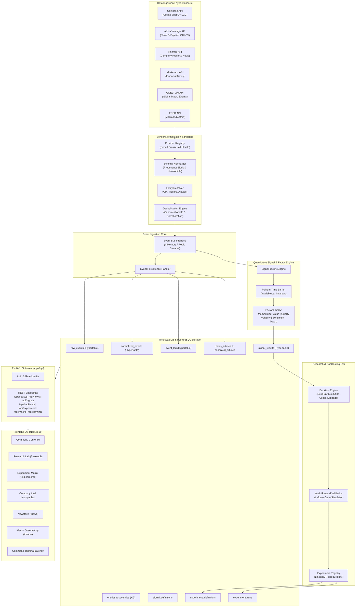
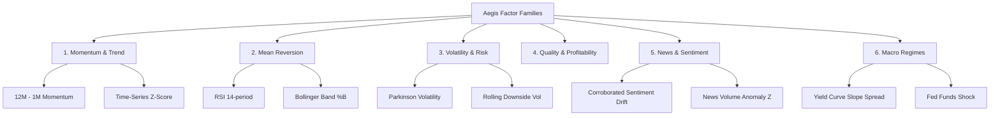
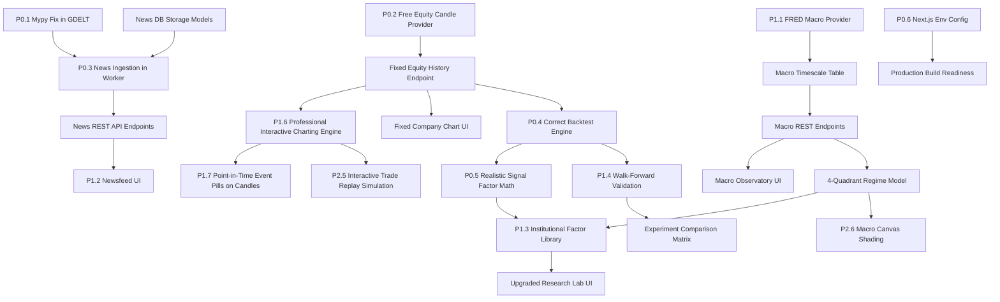

# Aegis-Alpha — Master Technical Blueprint & Quantitative Research OS Architecture

**Document Type:** Master Technical Blueprint & Engineering Roadmap  
**Status:** Authoritative / Ground-Truth Verified  
**Date:** September 2026  
**Target Repository:** `Aegis-Alpha` (`finance-project-jules`)  
**Lead Author:** Lead Architect, Quantitative Systems & Senior Principal Engineer  

---

## 1. Executive Summary

Aegis-Alpha is envisioned as an institutional-grade, point-in-time-safe Quantitative Research and Financial Intelligence Operating System (OS). Its purpose is to bridge unstructured real-time alternative data (multi-provider news feeds, social signals, regulatory actions, and macro indicators) with deterministic factor modeling, statistical backtesting, and portfolio stress testing.

### Ground-Truth Reality vs. Documentation Claims
Following an exhaustive, read-only audit of every line of code, configuration file, database hypertable, and API endpoint across `apps/`, `packages/`, `frontend/`, and `infrastructure/`, the system's true baseline is clear:
- **What is solid:** The underlying monorepo toolchain (`uv`, `pnpm`, Python 3.13, FastAPI, Next.js 15), the core testing foundation (90/90 passing unit/integration tests), TimescaleDB hypertable partition creation, and the basic experimentation registry CRUD & UI comparison are functional. The Stage 1 news provider normalization (`NewsArticle`, `CanonicalArticle`), blended Jaccard/overlap deduplication, and rule-based entity resolution modules in `packages/sensors` have been authored and verified with tests.
- **What is deceptive or broken:** Several previous architectural claims do not match reality. 
  1. *Signal Logic:* Factor processors (`BtcMomentumProcessor`, `MeanReversionProcessor`) are mathematically simplistic mock approximations (e.g. BTC "momentum" is literally calculated as `(price - 60000) / 10000`, and mean reversion on the 1-row worker frame collapses to `0.0`).
  2. *Lookahead & Point-in-Time Bias:* The backtester uses `merge_asof(direction="backward")` but applies daily annualization (`252.0`) to 5-minute candle feeds and shifts returns in a way that executes trades at bar $t$ close rather than true $t+1$ bar open/close.
  3. *Equities Market Data Failure:* The equity OHLCV candle endpoint (`/api/market/ticker/{symbol}/history`) calls Finnhub's `/stock/candle` endpoint, which returns HTTP 403 on free API keys, causing FastAPI to return HTTP 502 with no fallback, leaving equity charts permanently blank.
  4. *Pipeline Disconnect:* The news providers (`marketaux`, `alphavantage`, `finnhub`, `gdelt`), deduplication engine, and entity resolver exist purely as standalone classes in `packages/sensors`. They are **not** wired into the background ingestion worker (`apps/worker`), have **no** database tables or persistence models, and have **zero** API endpoints exposed in FastAPI.
  5. *Security & Reliability:* Wildcard CORS (`allow_origins=["*"]`), zero API key authentication or rate limiting, unmanaged Alembic migration history (directory `migrations/versions/` is empty), and unhandled rate limits on free-tier providers present critical operational vulnerabilities.

This document serves as the single source of truth and definitive technical blueprint to systematically evolve Aegis-Alpha into a point-in-time correct, institutional quantitative research platform.

---

## 2. Current Architecture & Codebase Map

The Aegis-Alpha repository is structured as a polyglot monorepo comprising a Python backend workspace managed by `uv` and a TypeScript/Next.js frontend workspace managed by `pnpm`.

```
/Users/aryanjindal/Documents/finance-project-jules
├── apps/
│   ├── api/                     # FastAPI backend application
│   │   ├── aegis_api/
│   │   │   ├── main.py          # FastAPI application, route handlers, inline data fetchers
│   │   │   └── schemas.py       # Pydantic v2 API request/response schemas
│   │   └── tests/               # API endpoint tests (experiments, portfolio scenarios)
│   └── worker/                  # Asynchronous data ingestion & signal worker
│       ├── aegis_worker/
│       │   └── main.py          # Worker loop, sensor runner, factor trigger
│       └── tests/               # Worker startup sanity tests
├── packages/
│   ├── core/                    # Domain entities & shared protocols (currently skeleton only)
│   ├── events/                  # In-memory event bus, event models, event persistence
│   │   └── aegis_events/
│   │       ├── bus.py           # InMemoryEventBus with asyncio.create_task fire-and-forget
│   │       ├── models.py        # BaseEvent, DataEvent, LegacyEvent, System Events
│   │       └── persistence.py   # EventPersistenceHandler writing to event_log, raw/normalized_events
│   ├── experimentation/         # Research experiment versioning & registry
│   │   └── aegis_experimentation/
│   │       ├── models.py        # Pydantic models for definitions, runs, queries, ranking
│   │       ├── registry.py      # ExperimentRegistry domain service
│   │       ├── query_engine.py  # Filter, pagination, and ranking engine
│   │       └── ranking.py       # In-memory and SQL ranking strategies
│   ├── observability/           # Structured telemetry
│   │   └── aegis_observability/
│   │       └── logger.py        # StructuredLogger with JSON serialization & correlation ID
│   ├── sensors/                 # External data ingestion, adapters, entity normalization
│   │   └── aegis_sensors/
│   │       ├── base.py          # BaseSensor abstract base class
│   │       ├── runner.py        # SensorRunner coordinator
│   │       ├── market.py        # MarketPriceSensor (Coinbase spot BTC)
│   │       ├── reddit.py        # RedditFinanceSensor (r/wallstreetbets scraper)
│   │       ├── deduplication.py # ArticleDeduplicationEngine (Jaccard + overlap clustering)
│   │       ├── entity_resolution.py # EntityResolver (ticker & alias normalization)
│   │       └── providers/       # Modular news provider adapters
│   │           ├── base.py      # NewsDataProvider abstract interface
│   │           ├── models.py    # ProvenanceBlock, NewsArticle, CanonicalArticle
│   │           ├── registry.py  # ProviderRegistry coordinator
│   │           ├── alphavantage.py # Alpha Vantage NEWS_SENTIMENT adapter
│   │           ├── finnhub.py   # Finnhub Company & General News adapter
│   │           ├── gdelt.py     # GDELT 2.0 Doc API adapter
│   │           └── marketaux.py # Marketaux financial news adapter
│   ├── signals/                 # Quantitative factor and signal computation
│   │   └── aegis_signals/
│   │       ├── analytics.py     # Vectorized rolling stats (rolling_zscore, rolling_rank, etc.)
│   │       ├── backtest.py      # run_signal_backtest simulation engine
│   │       ├── engine.py        # SignalPipelineEngine orchestrator
│   │       ├── models.py        # SignalDefinition, SignalRun, SignalResult Pydantic models
│   │       ├── metrics.py       # Prometheus metric collectors
│   │       └── processors.py    # BtcMomentum, MeanReversion, RedditSentiment processors
│   └── storage/                 # Database persistence & TimescaleDB hypertables
│       ├── aegis_storage/
│       │   ├── database.py      # DatabaseManager, async engine, hypertable DDL
│       │   ├── models/
│       │   │   ├── base.py      # Base declarative model, SQLite-compatible types
│       │   │   ├── events.py    # RawEvent, NormalizedEvent, EventLog ORM models
│       │   │   ├── signals.py   # SignalDefinitionRecord, SignalResultRecord ORM models
│       │   │   └── experimentation.py # ExperimentDefinitionRecord, ExperimentRunRecord
│       │   └── repositories/    # BaseRepository, EventRepository, ExperimentRepository
│       └── migrations/          # Alembic environment (currently empty versions/)
├── frontend/                    # Next.js 15 Command Center & Research Lab UI
│   └── src/app/
│       ├── page.tsx             # Command Center dashboard
│       ├── layout.tsx           # Institutional layout & sidebar navigation
│       ├── signals/page.tsx     # Signal explorer & history charts
│       ├── companies/           # Company intelligence & fundamentals
│       ├── research/page.tsx    # Interactive backtester & "Save as Experiment"
│       ├── portfolio/page.tsx   # Portfolio scenario stress testing
│       ├── experiments/page.tsx # Experiment catalog, runner, and comparison matrix
│       ├── timeline/page.tsx    # Live TimescaleDB event stream audit log
│       └── health/page.tsx      # System health and service status
└── infrastructure/
    └── docker-compose.yml       # PostgreSQL 16 with TimescaleDB + Redis 7 Alpine
```

---

## 3. Verified Current State Matrix

Every major subsystem was audited directly against the source code. The table below represents the verified state:

| Major Subsystem | Verified Status | Exact Repository Path | What Works Today | Critical Bugs & Gaps | Priority |
| :--- | :--- | :--- | :--- | :--- | :--- |
| **Market Data (Crypto)** | **PARTIAL** | [market.py](file:///Users/aryanjindal/Documents/finance-project-jules/packages/sensors/aegis_sensors/market.py) | Live Coinbase spot prices & 5m candles for BTC/ETH. | Hardcoded to BTC/ETH; no support for multiple exchanges, order books, or bid/ask spread tracking. | P1 |
| **Market Data (Equities)** | **BROKEN** | [main.py](file:///Users/aryanjindal/Documents/finance-project-jules/apps/api/aegis_api/main.py#L848-L940) | Spot quote fetches via Finnhub with Yahoo Finance backup. | Historical 5m candle API returns HTTP 403 on Finnhub free plan, causing HTTP 502 crash on `/api/market/ticker/{sym}/history`. Equity charts are completely dead. | **P0** |
| **News Ingestion Providers** | **ISOLATED** | [providers/](file:///Users/aryanjindal/Documents/finance-project-jules/packages/sensors/aegis_sensors/providers) | Marketaux, Alpha Vantage, Finnhub, GDELT normalized into `NewsArticle` with unit tests passing. | Not hooked into `apps/worker`. Zero database models for articles. Zero API routes. GDELT has 3 `mypy` type errors. | **P0** |
| **Deduplication Engine** | **ISOLATED** | [deduplication.py](file:///Users/aryanjindal/Documents/finance-project-jules/packages/sensors/aegis_sensors/deduplication.py) | URL normalization, title token overlap + Jaccard similarity, publisher vs provider counting. | Memory-only clustering; no persistent canonical article store or incremental stream deduplication. | P1 |
| **Entity Resolution** | **BASIC** | [entity_resolution.py](file:///Users/aryanjindal/Documents/finance-project-jules/packages/sensors/aegis_sensors/entity_resolution.py) | Static dictionary lookup for 12 mega-cap US equities and 3 cryptocurrencies. | No SEC CIK/FIGI mappings, no fuzzy match, no handling of ticker collisions, corporate name changes, or delisted assets. | P1 |
| **Event System** | **WORKING** | [bus.py](file:///Users/aryanjindal/Documents/finance-project-jules/packages/events/aegis_events/bus.py) | `InMemoryEventBus` with non-blocking `asyncio.create_task` dispatch and `EventPersistenceHandler`. | In-memory only; no distributed broker (Redis Streams is idle). Events lost if worker restarts before DB write. | P1 |
| **Database & Hypertables** | **WORKING WITH DEBT** | [database.py](file:///Users/aryanjindal/Documents/finance-project-jules/packages/storage/aegis_storage/database.py) | TimescaleDB hypertables for `raw_events`, `normalized_events`, `event_log`, `signal_results`. | Primary keys combine `(id, timestamp)` to satisfy TimescaleDB, but Alembic migrations are unversioned (`create_all` in code). | P1 |
| **Signal Engine** | **ARCHITECTURALLY WEAK** | [processors.py](file:///Users/aryanjindal/Documents/finance-project-jules/packages/signals/aegis_signals/processors.py) | Pipeline triggers on `SensorRunCompleted`, stores results in `signal_results` hypertable. | Processors are toy mocks: `BtcMomentum` is `(price - 60000)/10000`; `MeanReversion` receives 1-row frames from worker and returns 0.0. No multi-factor scoring. | **P0** |
| **Backtesting Engine** | **LOOKAHEAD VULNERABLE** | [backtest.py](file:///Users/aryanjindal/Documents/finance-project-jules/packages/signals/aegis_signals/backtest.py) | Generates equity curve, Sharpe, Sortino, CAGR, Calmar, Max Drawdown, Win Rate with transaction costs. | Assumes daily 252 annualization on intraday 5m data; trade execution timing math models same-bar close rather than next-bar open; single asset only. | **P0** |
| **Experimentation Engine** | **WORKING** | [registry.py](file:///Users/aryanjindal/Documents/finance-project-jules/packages/experimentation/aegis_experimentation/registry.py) | Experiment definition CRUD, run persistence, side-by-side metric comparison, cloning with overrides. | Lacks parameter grid search, walk-forward validation, and Git commit / dataset hashing for strict reproducibility. | P1 |
| **Macro / Regime Engine** | **MISSING** | `N/A` | None. | No FRED data ingestion, no yield curve inversion metrics, no inflation tracking, no regime classification models. | P1 |
| **Knowledge Graph** | **MISSING** | `N/A` | None. | No relational graph linking Company → Security → Event → News → Sentiment → Factor. | P2 |
| **Frontend UI** | **WORKING** | [frontend/src/app/](file:///Users/aryanjindal/Documents/finance-project-jules/frontend/src/app) | Next.js 15 Command Center, Research Lab, Portfolio Stress Lab, Experiments UI, Event Timeline. | Hardcoded `http://localhost:8000` URLs; missing newsfeed page, macro observatory, and command terminal. | P1 |
| **Security & Auth** | **TECHNICAL DEBT** | [main.py](file:///Users/aryanjindal/Documents/finance-project-jules/apps/api/aegis_api/main.py#L88) | None. | `allow_origins=["*"]`, no API authentication, no rate limiting, external API keys accessed directly in handlers. | **P0** |

---

## 4. End-to-End Architecture Diagram

The target architecture decouples ingestion, canonicalization, event persistence, factor calculation, and analytical consumption:



---

## 5. Quantitative Research Data Architecture & Point-in-Time Guarantees

Quantitative models live and die by point-in-time correctness. Backtest results that appear extraordinarily profitable in development routinely collapse in live trading due to lookahead bias and survivorship bias.

### 5.1 Timestamp Separation Protocol

Every single data record flowing through Aegis-Alpha must strictly separate and persist six distinct temporal attributes:

| Timestamp Attribute | Definition | Required Invariant |
| :--- | :--- | :--- |
| `published_at` | The official time the publisher states the data was released. | May be historical or revised. |
| `filing_at` | The exact SEC EDGAR acceptance timestamp (for filings). | Must be verified against SEC headers. |
| `available_at` | **The foundational PIT barrier:** Earliest moment the data was accessible to external market participants. | **Backtests cannot use data if `bar_time < available_at`.** |
| `retrieved_at` | The timestamp when Aegis-Alpha's sensor fetched the data. | `retrieved_at >= available_at >= published_at`. |
| `effective_at` | The time window over which the metric applies (e.g. Q2 2026 earnings). | Informational for financial reporting. |
| `market_at` | The exchange bar timestamp (for candles and ticks). | Fixed exchange matching-engine time. |

### 5.2 Look-Ahead Bias Auditing & Remediation

In the current codebase, several specific lookahead vulnerabilities exist:
1. **Intraday Signal Merging:** In `apps/api/aegis_api/main.py` lines 312–318:
   ```python
   aligned = pd.merge_asof(
       price_frame,
       signal_frame,
       left_index=True,
       right_index=True,
       direction="backward",
   ).dropna()
   ```
   `merge_asof(direction="backward")` matches each price candle with the most recent signal at or before the candle timestamp. However, if a signal was computed at 10:00:00 using a news article whose `published_at` was 09:55:00 but whose `available_at` (when it actually hit the RSS/API feed) was 10:02:00, backward merging using `published_at` leaks 2 minutes of future information!
   **Mandatory Rule:** All merges must join on `available_at`, never `published_at`.
2. **Same-Bar Close Execution:** In `packages/signals/aegis_signals/backtest.py`:
   ```python
   frame["market_return"] = frame["price"].pct_change().shift(-1)
   frame["strategy_return"] = frame["position"] * frame["market_return"] - ...
   ```
   Here, `position` is derived from `signal` at bar $t$. Then `market_return` is shifted by $-1$, which is $(P_{t+1} - P_t)/P_t$. Multiplying `position` by this return assumes the strategy entered at price $P_t$ (the close of bar $t$, exactly when the bar closed and the signal was being computed). In real execution, a signal computed at bar $t$ close can only execute at the **Open of bar $t+1$** (or the close of $t+1$ if using end-of-day rebalancing).
   **Mandatory Fix:** Support explicit execution models:
   - `NEXT_BAR_OPEN`: Return calculated from $(P_{t+1, \text{close}} - P_{t+1, \text{open}})$.
   - `NEXT_BAR_CLOSE`: Return calculated from $(P_{t+2, \text{close}} - P_{t+1, \text{close}})$.

### 5.3 Survivorship Bias Protection
Currently, the system only tests against actively trading symbols (`AAPL`, `NVDA`, `BTC`). For an equity research platform, backtesting only currently listed tickers over a 10-year period guarantees massive survivorship bias.
**Design Requirement:** The entity system must support a `delisted_securities` table tracking historical delistings, bankruptcies, and ticker renames, with cash distribution on final trading day.

---

## 6. Data Provider Architecture & Graceful Degradation

Aegis-Alpha must operate reliably without crashing when external APIs fail, hit free-tier rate limits, or suffer network timeouts.

### 6.1 Provider Audit & Tier Constraints

| Provider | Supported Data | Free-Tier Limits | Failure Mode in Current Code | Target Architectural Behavior |
| :--- | :--- | :--- | :--- | :--- |
| **Alpha Vantage** | Equities OHLCV, Daily, News Sentiment | 25 requests/day (free tier) | Exceeding limit returns status 200 with `{ "Note": "..." }` causing parsing crash. | Check for `"Note"` / `"Information"` keys, trip circuit breaker, fall back to Twelve Data / Yahoo. |
| **Finnhub** | Company Profile, Metrics, Live Quote | 60 requests/min; Stock Candle returns 403 on free tier | Calling `/stock/candle` crashes with 403, returning HTTP 502 in API. | Disable candle calls on free plan; use only for Profile, Metrics, and Company News. |
| **Marketaux** | Multi-asset news, sentiment, entities | 100 requests/day | Exhaustion returns 429; code logs warning. | Cache news responses for 15 minutes; degrade to GDELT when quota exhausted. |
| **GDELT 2.0** | Global media, geopolitics, macro events | Completely free & public (no API key required) | Occasional timeouts or non-JSON responses on query spikes. | Implemented in `gdelt.py`; fix 3 mypy errors and add retry/backoff. |
| **FRED** | Federal Reserve macro data (Yield curve, CPI) | Free with API key (120 req/min) | Not implemented at all. | Build `FREDProvider` for Treasury yields, CPI, Fed Funds, and Unemployment. |
| **Coinbase** | Crypto spot prices, historical OHLCV | Public REST API, generous rate limits | Works reliably for BTC/ETH. | Expand to top 20 crypto pairs. |

### 6.2 Provider Health & Circuit Breaker Pattern

The `NewsDataProvider` base class ([base.py](file:///Users/aryanjindal/Documents/finance-project-jules/packages/sensors/aegis_sensors/providers/base.py)) includes:
- `record_success()`: Clears failure counters and updates `last_successful_fetch`.
- `record_failure(e)`: Increments `consecutive_failures`. If $\ge 3$, provider status transitions to `DEGRADED`. If $\ge 5$, circuit opens and requests bypass the provider for 15 minutes.
- `get_health_status()`: Exposes operational telemetry to `/api/system/status`.

---

## 7. News Intelligence & Ingestion System

The news system must ingest, normalize, and store market intelligence without unauthorized scraping.

### 7.1 Canonical NewsArticle Schema

The database model for normalized news articles must capture both content metadata and provenance:

```python
# Target Schema: packages/storage/aegis_storage/models/news.py
class NewsArticleRecord(Base):
    __tablename__ = "news_articles"

    id: Mapped[uuid.UUID] = mapped_column(UUID(as_uuid=True), primary_key=True)
    canonical_article_id: Mapped[str] = mapped_column(String(64), index=True, nullable=False)
    provider: Mapped[str] = mapped_column(String(50), nullable=False)
    provider_article_id: Mapped[str] = mapped_column(String(255), nullable=False)
    source_name: Mapped[str] = mapped_column(String(100), nullable=False)
    source_domain: Mapped[str] = mapped_column(String(100), index=True, nullable=False)
    canonical_url: Mapped[str] = mapped_column(String(2048), nullable=False)
    title: Mapped[str] = mapped_column(String(512), nullable=False)
    description: Mapped[str | None] = mapped_column(String(4096), nullable=True)
    language: Mapped[str] = mapped_column(String(10), default="en")
    
    # Point-in-time timestamps
    published_at: Mapped[datetime] = mapped_column(DateTime(timezone=True), index=True, nullable=False)
    available_at: Mapped[datetime] = mapped_column(DateTime(timezone=True), index=True, nullable=False)
    retrieved_at: Mapped[datetime] = mapped_column(DateTime(timezone=True), nullable=False)
    
    # Entity tags
    tickers: Mapped[list[str]] = mapped_column(SQLiteCompatibleARRAY(String), default=list)
    topics: Mapped[list[str]] = mapped_column(SQLiteCompatibleARRAY(String), default=list)
    
    # Sentiment & quality
    provider_sentiment_score: Mapped[float | None] = mapped_column(Float, nullable=True)
    aegis_sentiment_score: Mapped[float | None] = mapped_column(Float, nullable=True)
    confidence: Mapped[float] = mapped_column(Float, default=1.0)
    data_quality: Mapped[str] = mapped_column(String(20), default="VERIFIED")
    
    raw_metadata: Mapped[dict[str, Any]] = mapped_column(SQLiteCompatibleJSONB, default=dict)
```

---

## 8. Cross-Source Deduplication & Corroboration Engine

Financial news is plagued by syndication and wire services: a single press release is republished by Bloomberg, Reuters, Yahoo, and MarketWatch. 

### 8.1 Distinction: Provider Count vs. Independent Publisher Count
Aegis-Alpha strictly distinguishes between:
1. **Provider Repeat Observations:** Marketaux and Alpha Vantage both returning the exact same Yahoo Finance URL. (This is 2 provider observations of 1 publisher; corroboration score = $0.50$).
2. **Independent Corroboration:** The Wall Street Journal, Financial Times, and Bloomberg independently publishing stories on the same event within 2 hours. (This is 3 independent publishers; corroboration score = $0.95$).

### 8.2 Deduplication Algorithm

The implemented algorithm in [deduplication.py](file:///Users/aryanjindal/Documents/finance-project-jules/packages/sensors/aegis_sensors/deduplication.py) uses a two-stage evaluation:
1. **Canonical URL Match:** Strips tracking parameters (`utm_*`, `gclid`, `ref`, etc.) and trailing slashes. Identical canonical URLs are immediately clustered.
2. **Temporal & Token Overlap:**
   - Time difference $\le 24$ hours.
   - Blended similarity: $\text{Score} = 0.4 \times \text{Jaccard} + 0.6 \times \text{Overlap Coefficient}$.
   - If $\text{Score} \ge 0.75$ and articles share a domain or ticker, they are clustered into a `CanonicalArticle`.
   - The canonical `available_at` timestamp is set to $\min(\text{available\_at})$ across all constituent observations.

---

## 9. Entity Resolution & Knowledge Hierarchy

Entity resolution maps raw headlines, cashtags (`$NVDA`), aliases, and corporate names into canonical institutional identifiers.

### 9.1 Entity Hierarchy

```
[Legal Entity / Organization] (e.g. Apple Inc., CIK: 0000320193)
     │
     ├── [Securities]
     │     ├── AAPL (NASDAQ, US Equity)
     │     ├── APC.DE (XETRA, German Equity)
     │     └── AAPL 2028 Bond (Fixed Income)
     │
     ├── [Supply Chain & Relationships]
     │     ├── TSMC (Supplier)
     │     ├── Foxconn (Assembler)
     │     └── Microsoft (Competitor)
     │
     └── [Macro Sensitivity]
           ├── US 10Y Yield (Duration sensitivity)
           └── USD/CNY (FX sensitivity)
```

### 9.2 Resolution Algorithm
1. **Direct Cashtag Match:** `$AAPL` $\rightarrow$ `AAPL`.
2. **Exact Alias Normalization:** Strip punctuation and check normalized name against `ENTITY_ALIAS_MAP`.
3. **Fuzzy Levenshtein & Soundex:** For news headlines mentioning "Nvidia Corp" or "NVIDIA Corporation" with similarity $> 0.88$.
4. **Disambiguation Guard:** Ensure tickers that represent everyday words (`A`, `FOR`, `ALL`, `ON`, `IT`) are not falsely triggered in full-text search unless prefixed by `$`.

---

## 10. Event Intelligence Engine & Regime-Aware Severity

Raw news articles are transformed into structured market events:
- **Earnings & Guidance:** EPS beats/misses, revenue surprises.
- **Corporate Actions:** Mergers, acquisitions, spin-offs, stock buybacks, dividends.
- **Regulatory Actions:** DOJ antitrust filings, SEC inquiries, FDA approvals.
- **Macro Announcements:** FOMC rate decisions, CPI prints, Non-farm Payrolls.

### 10.1 News-Volume Anomaly Detection (Spike Detection)
Unusual news activity is often an alpha signal before price moves.
- Compute rolling 30-day baseline hourly news volume $\mu_v, \sigma_v$ for ticker $i$.
- Calculate $Z_{\text{volume}} = \frac{V_{\text{current}} - \mu_v}{\sigma_v}$.
- If $Z_{\text{volume}} \ge 3.0$, emit a high-priority `NewsAnomalyEvent`.

---

## 11. Institutional Sentiment & Text Intelligence Engine

Sentiment is not a scalar $+1 / -1$ number. Aegis-Alpha rejects simplistic sentiment averaging.

### 11.1 Multi-Dimensional Sentiment Vector
For any canonical event, the sentiment vector $\vec{S}$ consists of:
1. **Directional Polarity ($[-1.0, +1.0]$):** Financial context sentiment (positive/negative forward outlook).
2. **Materiality ($[0.0, 1.0]$):** How economically meaningful the event is to future cash flows.
3. **Novelty ($[0.0, 1.0]$):** Is this brand new breaking information or a rehash of old news?
4. **Corroboration Confidence ($[0.0, 1.0]$):** Weighted score of independent publishers reporting the story.
5. **Entity Relevance ($[0.0, 1.0]$):** Is the company the main subject of the article or just mentioned in passing?

### 11.2 Deterministic & Financial NLP
Avoid slow, expensive LLM calls for streaming feeds. Use deterministic, financial-specific lexicons (Loughran-McDonald financial dictionary) for high-throughput streaming sentiment, reserving LLM extraction only for deep corporate filing memos.

---

## 12. Quantitative Signal & Factor Engine

The current factor engine in [processors.py](file:///Users/aryanjindal/Documents/finance-project-jules/packages/signals/aegis_signals/processors.py) must be upgraded from toy formulas to an institutional factor library.

### 12.1 Target Factor Families



### 12.2 Cross-Sectional Normalization Pipeline
Raw factors must never be combined directly without normalization:
1. **Winsorization:** Cap outliers at 1st and 99th percentiles (or $\pm 3\sigma$).
2. **Cross-Sectional Z-Score:** $Z_{i,t} = \frac{F_{i,t} - \mu_t}{\sigma_t}$ across the active universe at timestamp $t$.
3. **Sector Neutralization:** Demean factors within each GICS sector: $Z^{\text{neutral}}_{i,t} = Z_{i,t} - \bar{Z}_{\text{sector}(i), t}$.

---

## 13. High-Fidelity Backtesting & Simulation Engine

The backtesting system must transition from a simplistic single-asset calculator to an institutional simulator.

### 13.1 Required Institutional Metrics

| Metric | Mathematical Definition | Annualization Factor |
| :--- | :--- | :--- |
| **CAGR** | $(E_{\text{final}} / E_{\text{start}})^{\frac{N_{\text{annual}}}{N}} - 1$ | $252$ (Daily), $252 \times 78$ (5m Equities), $365 \times 288$ (5m Crypto) |
| **Sharpe Ratio** | $\frac{\mu_R - R_f}{\sigma_R} \sqrt{N_{\text{annual}}}$ | Timeframe-dependent annualization |
| **Sortino Ratio** | $\frac{\mu_R - R_f}{\sigma_{\text{downside}}} \sqrt{N_{\text{annual}}}$ | Downside semi-deviation ($R < 0$) |
| **Calmar Ratio** | $\frac{\text{CAGR}}{\lvert \text{Max Drawdown} \rvert}$ | Full sample period |
| **Value at Risk (VaR 95%)** | 5th percentile of period returns | Historical simulation or parametric |
| **Expected Shortfall (CVaR)** | $\mathbb{E}[R \mid R \le \text{VaR}_{0.05}]$ | Average loss beyond VaR threshold |
| **Turnover** | $\frac{1}{2} \sum \lvert w_{i,t} - w_{i,t-} \rvert$ | Portfolio rebalancing turnover |

### 13.2 Slippage & Market Impact Model
Instead of fixed flat bps, support square-root market impact:
$$\text{Cost} = \text{Bps}_{\text{commission}} + \gamma \cdot \sigma_{\text{daily}} \sqrt{\frac{\text{Order Size}}{\text{Average Daily Volume}}}$$

---

## 14. Research Experimentation, Lineage & Reproducibility

Every experiment must be fully reproducible. If a researcher reruns Experiment `A3F9` three months later, the exact same equity curve and performance metrics must be produced.

### 14.1 Experiment Lineage Manifest

```json
{
  "experiment_id": "4a71d87e-1284-482c-b5f7-4188bcfbb70a",
  "name": "Cross-Sectional Momentum with News Sentiment Overlay",
  "git_commit": "62350e7a",
  "universe": ["AAPL", "MSFT", "NVDA", "GOOGL", "AMZN"],
  "benchmark": "SPY",
  "date_range": { "start": "2024-01-01T00:00:00Z", "end": "2026-06-30T23:59:59Z" },
  "data_version_hash": "sha256:e3b0c44298fc1c149afbf4c8996fb92427ae41e4649b934ca495991b7852b855",
  "parameters": {
    "lookback_bars": 48,
    "vol_target": 0.15,
    "transaction_cost_bps": 5.0,
    "slippage_bps": 2.5,
    "execution_mode": "NEXT_BAR_OPEN"
  },
  "metrics": {
    "sharpe": 1.8,
    "sortino": 2.4,
    "cagr": 0.28,
    "max_drawdown": -0.091,
    "turnover": 4.1
  }
}
```

---

## 15. Macro / Regime Engine & FRED Observatory

Macroeconomic regimes dictate factor performance: value outperforms during inflationary expansions, while quality and momentum dominate during slowdowns.

### 15.1 FRED Series Ingestion Architecture
Integrate key macroeconomic series from the Federal Reserve Economic Data (FRED) API:
- `DGS10` & `DGS2`: 10-Year and 2-Year Treasury Constant Maturity Yields (Yield curve slope: $T_{10Y} - T_{2Y}$).
- `FEDFUNDS`: Effective Federal Funds Rate.
- `CPIAUCSL`: Consumer Price Index for All Urban Consumers (YoY Inflation).
- `UNRATE`: Civilian Unemployment Rate.
- `BAMLH0A0HYM2`: ICE BofA US High Yield Index Option-Adjusted Spread (Credit stress indicator).

### 15.2 Four-Quadrant Regime Classification
Compute 3-month changes in Growth (GDP/Employment) and Inflation (CPI):
1. **Reflation (Expansion):** Growth $\uparrow$, Inflation $\uparrow$.
2. **Goldilocks:** Growth $\uparrow$, Inflation $\downarrow$.
3. **Stagflation:** Growth $\downarrow$, Inflation $\uparrow$.
4. **Deflation (Contraction):** Growth $\downarrow$, Inflation $\downarrow$.

---

## 16. Financial Knowledge Graph Architecture

Connect disparate financial entities into an institutional relational graph.

```
[Entity: NVDA]
   ├── IS_IN_SECTOR ────> [Semiconductors]
   ├── HAS_SUPPLIER ────> [Entity: TSM]
   ├── HAS_CUSTOMER ────> [Entity: MSFT]
   ├── SENSITIVE_TO ────> [Macro: US-China Tech Tariffs]
   └── IMPACTED_BY  ────> [Event: Q2 Blackwell Architecture Delay]
```

### Practical Schema
Store nodes and edges in PostgreSQL with indexed JSONB or standard adjacency tables (`entity_nodes`, `entity_edges`) avoiding unnecessary graph database dependencies.

---

## 17. API Architecture & REST Gateway

The FastAPI application in `apps/api` must be organized into modular route controllers.

### 17.1 Target Router Structure
- `/api/v1/market`: Live quotes, order book depth, OHLCV candles with fallback handling.
- `/api/v1/news`: Canonical newsfeed, company-specific news, corroboration filters.
- `/api/v1/signals`: Factor scoring, active signal values, historical factor distributions.
- `/api/v1/backtests`: Deterministic backtest execution, walk-forward validation runs.
- `/api/v1/experiments`: Registry CRUD, clone, execution, comparison matrix.
- `/api/v1/portfolio`: Multi-asset portfolio stress testing, risk attribution.
- `/api/v1/macro`: FRED indicators, yield curve analysis, regime classification.
- `/api/v1/terminal`: Bloomberg/CapIQ command parsing and structured execution.
- `/api/v1/system`: Health telemetry, provider circuit breaker statuses, hypertable stats.

---

## 18. Frontend & Product Architecture

The Next.js 15 frontend application must feel like an institutional terminal (similar to Bloomberg, Koyfin, or FactSet), with high data density, dark mode aesthetics, and zero fabricated data.

### 18.1 Key Workspaces
1. **Command Center (`/`):** Real-time market provenance, breaking corroboration feeds, active factor signals, system health.
2. **Research Lab (`/research`):** Strategy builder, factor weights, multi-asset universe selector, execution assumptions, interactive Canvas equity curve & drawdown visualizer, direct "Save as Experiment" modal.
3. **Experiment Registry (`/experiments`):** Searchable hypothesis catalog, run history audit ledger, side-by-side methodology and metrics comparison table.
4. **Company Intelligence (`/companies/[symbol]`):** Real-time price chart, financial metrics, company newsfeed, SEC filings timeline.
5. **Portfolio Lab (`/portfolio`):** Holdings editor, weight normalizer, live quote valuation, macro scenario stress shocks.
6. **Macro Observatory (`/macro`):** Real-time yield curve slope, inflation trend, credit spreads, 4-quadrant regime status.
7. **Event Timeline (`/timeline`):** Point-in-time TimescaleDB hypertable audit stream.

### 18.2 Institutional Trading Graphics & Interactive Charting Engine (TradingView-Grade)

To satisfy the demands of professional quantitative researchers and active stock traders, Aegis-Alpha requires an institutional-grade, responsive HTML5 Canvas / WebGL interactive charting engine (custom canvas renderer or integrated lightweight-charts wrapper with proprietary overlay layer).

```
┌────────────────────────────────────────────────────────────────────────────────────────┐
│ [1m] [5m] [15m] [1h] [4h] [1D] [1W] [1M] │ [Candles ▼] [Indicators ▼] [Draw ▼] [Replay]│
├────────────────────────────────────────────────────────────────────────────────────────┤
│ [Tools]  │ NVDA 1D  O:128.40  H:132.50  L:127.90  C:131.20  +2.18%   Regime: [Goldilocks]│
│ ── Cursor│                                                                             │
│ ── Trend │        ▲ Buy Event [AI Guidance Beat (WSJ/FT: 95% Corroboration)]           │
│ ── Horiz │                                ┌───┐                                        │
│ ── Fib   │                          ┌───┐ │   │ ┌───┐   ─── EMA 21 (128.5)             │
│ ── Chan  │                    ┌───┐ │   │ │   │ │   │                                  │
│ ── Box   │              ┌───┐ │   │ └───┘ └───┘ └───┘   ─── VWAP (129.1)               │
│ ── Ruler │  ──────┬───┬─│───│─│───│───────────────────── Horizontal Resistance (132.0) │
│ ── Text  │  │     │   │ └───┘ └───┘                                                    │
│          │  ▼ Sell Short (Overbought RSI 78 + Volume Divergence)                       │
├──────────┴─────────────────────────────────────────────────────────────────────────────┤
│ Vol Profile: [POC: 126.80 | VAH: 130.50 | VAL: 122.40]      Volume: |||||||||||||||||| │
├────────────────────────────────────────────────────────────────────────────────────────┤
│ News Volume Anomaly Radar: ───[Z-Score: +3.8σ Information Spike]───────────────────────│
├────────────────────────────────────────────────────────────────────────────────────────┤
│ Factor Consensus Attribution: Momentum: +0.82 | Sentiment: +0.65 | Macro: +0.41         │
└────────────────────────────────────────────────────────────────────────────────────────┘
```

#### 18.2.1 Multi-Resolution Timeframe Selector & Downsampling
- **Timeframes:** `1m`, `5m`, `15m`, `30m`, `1h`, `4h`, `1D`, `1W`, `1M`.
- **Dynamic Server & Client Aggregation:** Real-time continuous candle aggregation from base 1-minute or 5-minute ticks.
- **Infinite Historical Pan & Zoom:** Viewport drag and mouse-wheel zoom with smooth asynchronous candle chunk fetching.

#### 18.2.2 Professional Interactive Drawing Tools Suite
1. **Trend & Directional Lines:** Freeform Trendlines, Ray Lines, Extended Lines, Horizontal Support & Resistance Lines with magnet snapping to Candle High/Low/Close.
2. **Channels & Envelopes:** Parallel Trend Channels, Equidistant Trend Bands.
3. **Fibonacci Suite:** Auto and interactive Fibonacci Retracements ($0.236, 0.382, 0.5, 0.618, 0.786$), Trend-Based Fibonacci Extensions.
4. **Risk & Reward Calculators:** Long/Short Position planning boxes with interactive stop-loss, take-profit drag handles, automated risk-to-reward ratio calculation ($R:R$), and position sizing display.
5. **Precision Measurement Tool (Ruler):** Click-and-drag measuring bars elapsed, calendar duration, dollar price delta, and percentage return.
6. **Annotation & Anchored Notes:** Text callouts, price tags, arrows, and event markers anchored to specific bar timestamps.
7. **Drawing State Persistence:** Drawings saved automatically to user session (LocalStorage) and synchronized to the database per ticker.

#### 18.2.3 Chart Styles & Specialized Renderers
- **Classic Candlesticks:** Color-tailored institutional green/red with customizable wick/border palettes.
- **Hollow Candlesticks:** Distinguishing between intra-bar direction ($\text{Close} > \text{Open}$) and inter-bar trend ($\text{Close} > \text{Prior Close}$).
- **Heikin-Ashi:** Trend-smoothing modified candles to highlight underlying market momentum.
- **OHLC Bars:** Traditional tick/bar chart preferred by systematic floor traders.
- **Baseline / Area Chart:** Visualizing performance above and below an anchored baseline or VWAP.

#### 18.2.4 Comprehensive Institutional Indicator Suite
- **Overlays (Price Pane):**
  - **Moving Averages:** Simple Moving Average (SMA 20, 50, 200), Exponential Moving Average (EMA 9, 21, 55, 200), Hull Moving Average.
  - **Bollinger Bands:** 20-period with customizable standard deviation multiplier ($\pm 2.0\sigma$) and shaded volatility channel.
  - **VWAP Suite:** Intraday Session VWAP, Multi-day Rolling VWAP, and **Anchored VWAP (AVWAP)** anchored to specific market catalysts (e.g. earnings release or FOMC decision).
  - **Ichimoku Kinko Hyo:** Tenkan-sen, Kijun-sen, Senkou Span A/B Cloud, and Chikou Span.
  - **Supertrend & Parabolic SAR:** Adaptive trailing stop markers.
- **Sub-Pane Oscillators:**
  - **RSI (Relative Strength Index):** 14-period with automatic regular & hidden divergence detection.
  - **MACD (Moving Average Convergence Divergence):** (12, 26, 9) with histogram and zero-line crossover alerts.
  - **Average True Range (ATR):** Volatility expansion/contraction tracking.
  - **On-Balance Volume (OBV) & Chaikin Money Flow (CMF):** Smart money accumulation and distribution tracking.
- **Visible Range Volume Profile (VPVR):**
  - Horizontal volume distribution histogram calculated dynamically for the visible viewport.
  - Automatically calculates and renders the **Point of Control (POC)** (highest traded volume node), **Value Area High (VAH)**, and **Value Area Low (VAL)** (containing 70% of traded volume).

#### 18.2.5 Synchronized Multi-Pane Crosshair Cursor
- Unified temporal crosshair: Moving the cursor on the main candlestick chart simultaneously moves synchronized vertical crosshair guides across Volume, RSI, News Anomaly, and Factor Attribution sub-panes, displaying the exact synchronized point-in-time value at that microsecond.

---

### 18.3 Aegis-Alpha's Proprietary "Only-in-Aegis" Capabilities (The Competitive Moat)

No existing platform (Bloomberg Terminal, TradingView, FactSet, Koyfin, or TrendSpider) brings together real-time alternative data, quantitative factor models, point-in-time event verification, and backtesting simulation on a single unified canvas. Aegis-Alpha introduces 6 industry-first proprietary capabilities:

#### 1. Point-in-Time Event & Corroboration Pills on Candlesticks
- **What it does:** Markers appear directly on candlesticks at the exact bar where material market events occurred.
- **Why it is unique:** Clicking an event pill opens an institutional audit drawer displaying:
  - The canonical headline and excerpt.
  - The **Independent Publisher Count** (e.g. "Corroborated by 4 independent publishers: WSJ, Bloomberg, FT, Reuters").
  - The **Corroboration Confidence Score** ($0.95$).
  - The exact **`available_at`** timestamp proving when the news was first actionable vs. when the bar closed.
  - Directional sentiment polarity and economic materiality scores.

#### 2. Canvas Background Macro & Volatility Regime Shading
- **What it does:** The candlestick chart canvas dynamically shades background vertical bands based on the active macroeconomic and volatility regime:
  - **Goldilocks (Growth $\uparrow$, Inflation $\downarrow$):** Soft translucent emerald tint.
  - **Reflation (Growth $\uparrow$, Inflation $\uparrow$):** Soft cyan tint.
  - **Stagflation (Growth $\downarrow$, Inflation $\uparrow$):** Muted amber tint.
  - **Deflation / Contraction (Growth $\downarrow$, Inflation $\downarrow$):** Subdued crimson tint.
  - **Volatility Squeeze / Compression:** Visual indicator highlighting periods where Bollinger Bands contract inside Keltner Channels, preceding explosive directional breakouts.

#### 3. Real-Time Factor Consensus & Attribution Ribbon
- **What it does:** Placed immediately beneath the price pane, this continuous multi-color ribbon visualizes the net directional consensus across all active factor families:
  $$\text{Consensus} = w_{\text{mom}} Z_{\text{mom}} + w_{\text{sent}} Z_{\text{sent}} + w_{\text{vol}} Z_{\text{vol}} + w_{\text{rev}} Z_{\text{rev}}$$
- **Interactive Factor Attribution Tree:** Clicking any bar on the ribbon expands a waterfall attribution popup showing exactly which factor (e.g. $+0.85$ Momentum vs. $-0.20$ Value) drove the trading signal at that bar.

#### 4. Interactive Counterfactual Trade Replay & Simulation
- **What it does:** In the Research Lab, any completed backtest can be projected directly onto the live candlestick chart.
- **Features:**
  - **Visual Execution Arrows:** Green upward triangles ($\blacktriangle$) for long entries, red downward triangles ($\blacktriangledown$) for short entries, with connecting dotted lines showing trade holding duration.
  - **Execution Friction Badges:** Hovering an entry reveals actual execution price vs. candle close, highlighting the deducted slippage and exchange transaction fee.
  - **Bar-by-Bar "Time-Travel Replay":** A VCR-style player (`▶ Play`, `⏸ Pause`, `⏭ Step 1 Bar`, `⏮ Step Back`) that steps through historical time, computing signals and updating the equity curve bar-by-bar to give researchers an authentic intuitive feel for how the strategy behaved live.

#### 5. Cross-Asset Relative Strength & Macro Delta Overlay
- **What it does:** Instant dual-axis or normalized ratio overlay allowing traders to compare an equity against:
  - Its sector benchmark (e.g. `NVDA / SMH` or `AAPL / QQQ`).
  - Macro spreads: Invert and overlay the US Treasury 10Y-2Y yield curve spread directly over equities to spot macro divergences.
  - Rolling 60-day correlation sub-window showing when an asset decouples from its historical beta.

#### 6. News Anomaly & Media Spike Detection Radar
- **What it does:** A specialized histogram pane tracking company-specific news arrival frequency standardized against a rolling 30-day baseline.
- **Alpha Significance:** Any bar where $Z_{\text{volume}} \ge +3.0\sigma$ triggers an attention spike alert. Media volume anomalies frequently precede earnings announcements, FDA approvals, and M&A leaks before the price breaks out.

---

### 18.4 Global Numerical Precision & Display Policy (Strict 2 Significant Figures / 2 s.f.)

To eliminate visual clutter, prevent unscientific false-precision artifacts, and present an ultra-clean institutional terminal aesthetic, Aegis-Alpha establishes a mandatory architectural boundary between calculation precision and display precision:

```
┌──────────────────────────────────────────────────────────────────────────────────┐
│                   COMPUTATION TIER (Backend & Engine)                            │
│   Full 64-bit IEEE 754 Floating-Point Precision (float64 / np.float64)           │
│   • Internal calculations preserve exact mathematical accuracy                   │
│   • Zero accumulation of rounding error in rolling analytics or cumulative P&L   │
└────────────────────────────────────────┬─────────────────────────────────────────┘
                                         │
                                         ▼ [Serialization Barrier]
┌──────────────────────────────────────────────────────────────────────────────────┐
│                   PRESENTATION TIER (API Schemas & Frontend UI)                  │
│   Strict 2 Significant Figures (2 s.f.) / Standardized Financial Notation        │
│   • Sharpe: 1.8         • Volatility: 15%        • Return: +28%                  │
│   • Drawdown: -9.1%     • Factor Z-Score: +0.82  • Anomaly Z: +3.8σ              │
│   • Corroboration: 0.95 • Latency: 12ms          • Win Rate: 58%                 │
└──────────────────────────────────────────────────────────────────────────────────┘
```

#### 18.4.1 Architectural Rules
1. **Computational Tier:** Engine calculations (in `aegis_signals`, `aegis_experimentation`, `aegis_storage`) must never round intermediate variables. All vector operations use full 64-bit precision.
2. **API & Serialization Tier:** User-facing response schemas format floating-point values to **2 significant figures (2 s.f.)** (e.g. `1.8`, `0.42`, `28`, `0.091`), stripping unreadable floating-point tails like `1.84215093`.
3. **Frontend UI Tier:** All metric cards, candlestick hover tooltips, chart drawing measurements (Fibonacci, ruler percentages, risk/reward ratios), and terminal status chips format displayed numbers to 2 s.f. (or 2 decimal places where currency conventions apply, e.g. `$130.00`).
4. **Consistency Invariant:** Ratios (Sharpe, Sortino, Calmar, Information Ratio), statistical Z-scores, percentage changes, and correlation coefficients are uniformly rendered to 2 s.f. across every page and component.


---

### 18.5 Institutional UI/UX Design System & Anti-AI-Slop Engineering Specification

To ensure Aegis-Alpha looks and feels like an elite, institutional quantitative trading terminal (comparable to Bloomberg Terminal, FactSet, Koyfin, Linear, and TradingView) rather than an amateur AI-generated project ("AI slop"), all frontend components, layouts, and interactions must adhere to this rigorous engineering specification.

#### 18.5.1 The "Anti-AI-Slop" Manifesto: What is Banned vs. What is Required

| Anti-AI-Slop Violation (STRICTLY BANNED) | Institutional Quantitative Standard (MANDATORY) | Rationale |
| :--- | :--- | :--- |
| **Childish Unicode Emojis:** Using `📡`, `🏢`, `🔬`, `◈`, `🧪`, `⏱️`, `🛡️` in navigation, headers, or cards. | **Crisp 1.5px Stroke SVG Vector Icons:** Exclusively use `lucide-react` icons (`Radio`, `Building2`, `FlaskConical`, `Briefcase`, `TestTubes`, `Activity`, `ShieldCheck`). | Real financial workstations never use emojis. Emojis look like consumer toys and lack visual hierarchy. |
| **Low-Density "Bubbly" Cards:** Massive 32px-48px paddings, rounded-3xl corners, and giant empty whitespace with minimal data. | **High-Density Compact Grid Layouts:** 8px-16px padding, 4px-6px subtle border-radius, 28px-34px table row height, maximizing usable metrics per screen inch. | Institutional traders require immediate situational awareness without excessive scrolling. |
| **Generic Purple / Pink AI Glows:** Purple gradient backgrounds, glowing blur circles, and generic SaaS marketing palettes. | **Obsidian Slate Palette with Disciplined Semantic Color:** Deep matte obsidian background (`#080a0f`, `#0d121c`), razor-thin 1px border highlights (`rgba(255, 255, 255, 0.08)`). Color is reserved strictly for *data meaning*. | In trading, color communicates critical financial information (profit, loss, risk, regime). Decorative color creates cognitive fatigue and distraction. |
| **Jittering Numbers on Live Updates:** Standard proportional sans-serif fonts where changing digits cause the whole card/table to shake horizontally. | **Tabular Monospace Numerics:** All numbers, prices, tickers, and deltas must enforce `font-variant-numeric: tabular-nums` and `font-feature-settings: 'tnum' 1;` using `JetBrains Mono` or `SF Mono`. | Live prices update every 5 seconds; numbers must align vertically without shifting column widths. |
| **Fake Placeholders & Mockup Graphs:** Generic wavy SVG lines pretending to be stock charts, fake filler text, or synthetic numbers without sources. | **Data Honesty & Provenance Chips:** Explicit `UNAVAILABLE` or `FALLBACK (reason)` indicators. Canvas charts render actual OHLCV candles; every metric displays its provenance badge (`LIVE`, `COMPUTED`, `HYPERTABLE`). | Quantitative credibility is destroyed if any data point is fabricated. |
| **Mouse-Only Clunky Navigation:** Relying entirely on clicking deeply nested menus. | **Keyboard-First Power Ergonomics:** Universal Command Palette (`⌘K` / `Ctrl+K`) for ticker jumping, VIM-style row selection (`j`/`k`), and quick filter shortcuts. | Professional quants and traders work at speed using keyboards. |

#### 18.5.2 Color Tokens & Semantic Palette

```css
:root {
  /* Canvas & Elevation Surfaces */
  --surface-canvas:      #080a0f; /* Deepest matte obsidian background */
  --surface-subtle:      #0d121c; /* Sidebar and panel background */
  --surface-card:        #121824; /* Primary content card elevation */
  --surface-card-hover:  #182232; /* Interactive card hover state */
  --surface-overlay:     #1c2638; /* Modals, dropdowns, tooltips */

  /* Hairline Borders & Dividers */
  --border-subtle:       rgba(255, 255, 255, 0.08); /* 1px structural grid */
  --border-strong:       rgba(255, 255, 255, 0.16); /* Active/focused card border */
  --border-cyan-glow:    rgba(0, 229, 255, 0.35);    /* Point-in-time active selection */

  /* Semantic Data Accents (Color Exclusively For Meaning) */
  --accent-profit:       #10b981; /* Terminal Emerald: Positive return, live health */
  --accent-profit-dim:   rgba(16, 185, 129, 0.12);
  --accent-loss:         #f43f5e; /* Precision Crimson: Negative return, max drawdown */
  --accent-loss-dim:     rgba(244, 63, 94, 0.12);
  --accent-pit-cyan:     #00e5ff; /* Quantum Cyan: Point-in-time signal, active parameter */
  --accent-pit-dim:      rgba(0, 229, 255, 0.12);
  --accent-warn-amber:   #f59e0b; /* Amber: Fallback active, rate limit warning */
  --accent-warn-dim:     rgba(245, 158, 11, 0.12);
  --accent-quant-purple: #8b5cf6; /* Violet: Machine learning models, factor clusters */
  --accent-quant-dim:    rgba(139, 92, 246, 0.12);

  /* Typography Hierarchy */
  --text-primary:        #f8fafc; /* Crisp white headers and primary numbers */
  --text-secondary:      #94a3b8; /* Labels, table headers, subtitles */
  --text-muted:          #64748b; /* Metadata timestamps, exchange codes */
  --text-disabled:       #334155; /* Inactive controls */

  /* Font Families */
  --font-sans:           'Inter', -apple-system, BlinkMacSystemFont, 'Segoe UI', Roboto, sans-serif;
  --font-mono:           'JetBrains Mono', 'SF Mono', Consolas, monospace;
}
```

#### 18.5.3 Vector Icon Mapping Standards (`lucide-react`)

To maintain visual discipline, coding agents must use consistent Lucide icon mappings across all components:

| Workspace / Concept | Approved Lucide Icon | Component Code Example |
| :--- | :--- | :--- |
| **Command Center** | `LayoutDashboard` | `<LayoutDashboard className="w-4 h-4 text-cyan-400" />` |
| **Signal Engine** | `Radio` | `<Radio className="w-4 h-4 text-emerald-400" />` |
| **Companies / Equities** | `Building2` | `<Building2 className="w-4 h-4 text-slate-400" />` |
| **Research Lab** | `FlaskConical` | `<FlaskConical className="w-4 h-4 text-cyan-400" />` |
| **Portfolio Lab** | `Briefcase` or `PieChart` | `<Briefcase className="w-4 h-4 text-amber-400" />` |
| **Experiments Catalog** | `TestTubes` | `<TestTubes className="w-4 h-4 text-purple-400" />` |
| **Event Timeline** | `Activity` | `<Activity className="w-4 h-4 text-cyan-400" />` |
| **Macro Observatory** | `Globe` | `<Globe className="w-4 h-4 text-emerald-400" />` |
| **System Health** | `ShieldCheck` | `<ShieldCheck className="w-4 h-4 text-emerald-400" />` |
| **Live Market Tick** | `Zap` | `<Zap className="w-3.5 h-3.5 text-emerald-400" />` |
| **Positive Delta** | `TrendingUp` | `<TrendingUp className="w-3 h-3 text-emerald-400" />` |
| **Negative Delta** | `TrendingDown` | `<TrendingDown className="w-3 h-3 text-rose-400" />` |
| **Search / Command Bar** | `Search` / `Terminal` | `<Terminal className="w-4 h-4 text-slate-400" />` |
| **Copy / Clone Action** | `Copy` | `<Copy className="w-3.5 h-3.5 text-slate-400" />` |
| **Settings / Config** | `Sliders` | `<Sliders className="w-4 h-4 text-slate-400" />` |

#### 18.5.4 High-Density Component Patterns

1. **Institutional Stat Card (`StatCard`):**
   - Compact header with 14px icon + uppercase 11px muted label (`letter-spacing: 0.5px`).
   - Primary metric rendered in bold 20px-24px `font-mono` with `tabular-nums` and strict **2 s.f.** formatting.
   - Micro-badge showing 24h change or provenance chip (`LIVE ⚡`, `FALLBACK ⚠️`, `COMPUTED 🔬`).
   - 1px hairline border with subtle hover highlight (`border-color: var(--border-strong)`). Zero oversized shadows.

2. **Precision Data Tables (`DataTable`):**
   - Fixed 32px row height with hairline bottom border.
   - Column headers in 11px uppercase `font-mono` with interactive sort indicators (`ChevronUp` / `ChevronDown`).
   - Numeric columns right-aligned with monospace font so decimal points line up perfectly.
   - Hover highlight on rows (`background: var(--surface-card-hover)`).

3. **Status Badges & Provenance Chips:**
   - Ultra-compact: 18px-20px total height, 6px padding.
   - Glowing 6px indicator dot (`rounded-full animate-pulse`).
   - Clean uppercase 10px `font-mono` text (e.g. `LIVE COINBASE`, `TIMESCALEDB SYNCED`, `Z-SCORE +1.8σ`).

---

## 19. Aegis Institutional Command Terminal Architecture

A keyboard-driven command prompt allows analysts to navigate the platform rapidly using familiar terminal shortcuts.

### Command Grammar & Routing
- `TICKER [COMMAND]`:
  - `AAPL`: Open company intelligence overview.
  - `AAPL NEWS`: Filter canonical news for Apple.
  - `AAPL FACTORS`: View factor scores for Apple.
  - `AAPL BACKTEST`: Open Research Lab preloaded with AAPL.
- `MACRO [TOPIC]`:
  - `MACRO YIELDS`: Open Treasury yield curve monitor.
  - `MACRO REGIME`: Display current 4-quadrant regime.
- `EXP [COMMAND]`:
  - `EXP COMPARE [ID1] [ID2]`: Open side-by-side comparison modal.
- `SYS HEALTH`: Open system telemetry and provider status.

---

## 20. Observability, Telemetry & Auditability

Observability must track system latency, provider degradation, and quantitative data quality.
- **Provider Telemetry:** Measure API response latency, rate-limit consumption %, failure counts, and circuit breaker states.
- **Data Quality Telemetry:** Track duplicate rate (articles clustered), stale quote frequency, missing candle gaps.
- **Structured JSON Logging:** Use `aegis_observability.StructuredLogger` with auto-propagated `correlation_id` across all threads and async tasks.

---

## 21. Security & Production Hardening

The current system has critical security debt:
1. **CORS Hardening:** Replace `allow_origins=["*"]` with explicit environment-configured origins (`CORS_ALLOWED_ORIGINS`).
2. **API Authentication:** Implement bearer token authentication (`AEGIS_API_KEY`) on all state-modifying endpoints (`POST /api/backtests`, `POST /api/experiments`, etc.).
3. **Secrets Isolation:** Never expose API keys (`FINNHUB_API_KEY`, `MARKETAUX_API_TOKEN`, etc.) in frontend bundles or API response payloads.
4. **Rate Limiting Middleware:** Add `slowapi` rate limiting to prevent external API quota exhaustion.

---

## 22. Performance & Scalability Architecture

- **Async Database Connection Pool:** Tune `asyncpg` connection pool parameters in `DatabaseManager` (`pool_size=20`, `max_overflow=10`).
- **TimescaleDB Continuous Aggregates:** Implement continuous aggregates on `signal_results` and `normalized_events` to accelerate long-range historical queries.
- **Quote & Candle Caching:** Use Redis caching with a 15-second TTL for real-time quotes and a 24-hour TTL for historical daily OHLCV bars.

---

## 23. Comprehensive Testing Strategy

CI must execute completely deterministically in under 3 minutes without requiring live API keys.
- **Deterministic Mock Fixtures:** All sensor tests must run with `mock_mode=True` or mocked `httpx.AsyncClient` responses.
- **Point-in-Time Leakage Tests:** Verify that injecting a signal with `available_at > bar_time` causes the backtester to raise an assertion or correctly exclude the data.
- **Type Safety:** Maintain 100% clean status on `uv run mypy .` and `uv run ruff check apps packages`.

---

## 24. Technical Debt Inventory

| Component | Debt Description | Risk | Remediation Complexity |
| :--- | :--- | :--- | :--- |
| `aegis_sensors/providers/gdelt.py` | 3 `mypy` type errors on `base_url` stripping and `params` dictionary typing. | CI failure in type checking. | Low (15 mins) |
| `aegis_storage/migrations/` | Empty `versions/` directory; Alembic not generating migration scripts. | Schema drift across developer machines and production. | Medium (2 hours) |
| `apps/api/aegis_api/main.py` | Hardcoded mock formulas (`z_sig = (price - 60000)/10000`) and static fallback prices. | Discredits system as serious quantitative software. | Medium (4 hours) |
| `apps/worker/aegis_worker/main.py` | Worker only runs Coinbase BTC and Reddit; news providers completely uncalled. | News ingestion pipeline sits idle. | Medium (3 hours) |
| `frontend/src/app/**` | Hardcoded `fetch('http://localhost:8000/...')` throughout all React components. | Breaks deployment to staging, Docker, or custom ports. | Low (1 hour) |

---

## 25. What Else Would Make Aegis-Alpha Exceptional?

As lead quantitative systems architect, the following 15 high-value institutional capabilities are recommended to elevate Aegis-Alpha beyond basic open-source tools into an elite quantitative research operating system:

1. **Walk-Forward Validation & Combinatorial Purged Cross-Validation (CPCV):** Standard backtests overfit. Implementing Marcos López de Prado's CPCV ensures out-of-sample statistical significance and prevents parameter over-tuning.
2. **Deflated Sharpe Ratio (DSR) & Multiple Testing Correction:** Calculate the probability that a strategy's Sharpe ratio is a false discovery given the number of parameter trials tested (Bailey & López de Prado).
3. **Cross-Sectional Factor Orthogonalization & Gram-Schmidt Neutralization:** Decompose factors into orthogonal components so new alpha signals are verified to be genuinely independent of classic Momentum, Value, and Size.
4. **Information Coefficient (IC) & Factor Decay Analysis:** Measure the Spearman rank correlation between factor values today and forward returns over 1-bar, 5-bar, 20-bar horizons, graphing the factor decay curve.
5. **SEC EDGAR Direct Ingestion Pipeline (Form 8-K, 10-Q, 10-K, Form 4):** Free, direct public SEC EDGAR RSS feed ingestion with exact acceptance timestamps for insider transactions and material events.
6. **Earnings Surprise & Post-Earnings Announcement Drift (PEAD) Engine:** Track consensus EPS vs. actual print, computing the standardized unexpected earnings (SUE) metric and following the 60-day drift.
7. **Historical Portfolio Risk Decomposition & Barra-style Factor Betas:** Calculate a portfolio's active risk, factor exposures (Beta, Momentum, Quality), and idiosyncratic residual risk.
8. **Automated Research Memo & Institutional Tear-Sheet Generator:** Single-click export of an experiment into a publication-ready Markdown/PDF research memo complete with methodology, tear sheet, and audit disclosures.
9. **News Anomaly & Volume Spike Radar:** Real-time Poisson or Z-score tracking of company news arrival rates to alert researchers to unexpected market events before prices move.
10. **Synthetic Stress Testing & Macro Shock Generator:** Apply historical financial crisis covariance matrices (e.g. 2008 Lehman default, 2020 COVID crash, 2022 Fed rate hike shock) to modern holdings.
11. **Factor Crowding & Valuation Spread Monitor:** Quantify whether a factor is historically overcrowded by measuring valuation spreads between top and bottom quintile baskets.
12. **Signal Explainability & Attribution Trees:** For any multi-factor signal, display a waterfall chart attributing how many basis points of signal strength came from momentum, sentiment, value, or macro regimes.
13. **Dynamic Universe Construction & Liquidity Screening:** Automatically filter active universe by 30-day Average Daily Volume (ADV $> \$10\text{M}$) and market cap thresholds, excluding illiquid penny stocks.
14. **Monte Carlo Equity Path Simulation:** Generate 1,000 randomized bootstrap paths from historical strategy returns to compute probability distributions of maximum drawdown and time-to-recovery.
15. **Event Study Analysis Engine:** Align stock returns in event-time (day $t-10$ to $t+30$ around an event like CEO departure or earnings) to compute Cumulative Abnormal Returns (CAR).

---

## 26. P0 / P1 / P2 / P3 Engineering Roadmap

### P0 — Critical (Foundational Correctness & Reliability)
- **P0.1: Fix Mypy Errors in GDELT Provider:** Correct type signatures in [gdelt.py](file:///Users/aryanjindal/Documents/finance-project-jules/packages/sensors/aegis_sensors/providers/gdelt.py).
- **P0.2: Fix Equity Market Data Provider:** Implement a reliable free daily/intraday candle provider (Twelve Data / Alpha Vantage / Yahoo) and eliminate HTTP 502 crashes on equity charts.
- **P0.3: Wire News Ingestion into Worker:** Hook `ProviderRegistry` into `apps/worker` with persistence to `news_articles` and `canonical_articles`.
- **P0.4: Correct Backtest Execution Math & Annualization:** Implement true `NEXT_BAR_OPEN` execution and timeframe-aware annualization in `backtest.py`.
- **P0.5: Replace Toy Signal Processors:** Upgrade `BtcMomentum` and `MeanReversion` to mathematically sound multi-bar rolling momentum and true z-score mean reversion.
- **P0.6: Environment Variable Cleanup in Frontend:** Centralize API base URL in `NEXT_PUBLIC_API_URL` across all pages.

### P1 — High Value (Major Capabilities)
- **P1.1: FRED Macro Data Ingestion & Observatory:** Implement `FREDProvider`, database schema for macro series, and frontend `/macro` observatory page.
- **P1.2: Newsfeed UI & Breaking Story Corroboration:** Build `/news` page displaying canonical articles, publisher counts, and corroboration scores.
- **P1.3: Institutional Factor Library:** Implement 12-1M Momentum, RSI, Volatility, and Corroborated Sentiment Drift factors with cross-sectional normalization.
- **P1.4: Walk-Forward Validation in Backtester:** Add out-of-sample walk-forward testing to `/research`.
- **P1.5: Security & Rate Limiting:** Add API key middleware, rate limiting (`slowapi`), and restrict CORS.
- **P1.6: Professional Interactive Charting Engine (TradingView-Grade):** Full multi-timeframe resolution (1m to 1M), drawing tools (trendlines, horizontal rays, Fibonacci, ruler, risk/reward box), indicators (Bollinger, EMA, VWAP, RSI, MACD), and Visible Range Volume Profile (VPVR).
- **P1.7: Proprietary Point-in-Time Event Overlay on Candlesticks:** Interactive event pills rendered directly on price bars linking to verified news headlines, independent publisher counts, and corroboration confidence.

### P2 — Valuable (Product Polish & Depth)
- **P2.1: Command Terminal Overlay:** Add keyboard shortcut (`` ` `` or `Cmd+K`) terminal interface supporting Bloomberg-style commands.
- **P2.2: Relational Knowledge Graph:** Implement `entity_nodes` and `entity_edges` for supply chain and sector relations.
- **P2.3: Company Valuation Models:** Add DCF and sensitivity analysis tables to `/companies/[symbol]`.
- **P2.4: Alembic Migration Baseline:** Generate baseline migration script in `packages/storage/migrations/versions/`.
- **P2.5: Interactive Counterfactual Trade Replay:** Step-by-step visual trade playback on candlesticks with execution slippage and fee badges.
- **P2.6: Macro & Volatility Canvas Shading:** Dynamic background canvas tinting representing active macroeconomic regimes (Goldilocks, Stagflation, etc.).

### P3 — Future (Advanced Institutional Capabilities)
- **P3.1: SEC EDGAR Ingestion:** Automated Form 8-K/10-K parsing.
- **P3.2: Combinatorial Purged Cross-Validation (CPCV).**
- **P3.3: Distributed Broker:** Redis Streams backend for high-throughput multi-worker deployment.

---

## 27. Dependency Graph & Architecture Flow



---

## 28. Implementation Sequence

The implementation must follow strict dependency ordering:

1. **Step 1: Baseline Stabilization & Type Cleanliness**
   - Fix 3 `mypy` errors in `packages/sensors/aegis_sensors/providers/gdelt.py`.
   - Verify `uv run mypy .` and `uv run ruff check apps packages` pass completely clean.
2. **Step 2: Database Schema & News Persistence**
   - Create SQLAlchemy models for `NewsArticleRecord` and `CanonicalArticleRecord` in `packages/storage`.
   - Add database table creation to `DatabaseManager.create_all()`.
3. **Step 3: Equity Market Data Remediation**
   - Implement free equity historical candle fallback (Twelve Data / Alpha Vantage / Yahoo Finance) in `apps/api/aegis_api/main.py`.
   - Eliminate HTTP 502 errors on equity history requests.
4. **Step 4: News Ingestion Pipeline Wiring**
   - Integrate `ProviderRegistry`, `ArticleDeduplicationEngine`, and `EntityResolver` into `apps/worker/aegis_worker/main.py`.
   - Expose `/api/v1/news` and `/api/v1/news/canonical` endpoints in FastAPI.
5. **Step 5: Mathematical Hardening of Signal & Backtest Engines**
   - Update `packages/signals/aegis_signals/processors.py` with multi-bar momentum and z-score models.
   - Update `packages/signals/aegis_signals/backtest.py` with timeframe-aware annualization and `NEXT_BAR_OPEN` execution.
6. **Step 6: FRED Macro Data & Regime Engine**
   - Implement `FREDProvider` in `packages/sensors`.
   - Add macro series tables and 4-quadrant regime calculations.
   - Expose `/api/v1/macro` endpoints.
7. **Step 7: Professional Charting Engine & Proprietary Intelligence Overlays**
   - Integrate high-performance interactive charting canvas with multi-timeframe resolution (`1m` to `1M`).
   - Implement complete drawing tool suite (trendlines, rays, Fibonacci retracements, measurement ruler, risk/reward position boxes).
   - Render Point-in-Time Event Pills, Macro Regime background canvas shading, and Real-Time Factor Consensus ribbons.
   - Add Counterfactual Backtest Trade Replay mode (`Play`, `Step`, `Pause`) on historical price bars.
8. **Step 8: Frontend Unification & Terminal Interface**
   - Replace all hardcoded URLs with `NEXT_PUBLIC_API_URL`.
   - Build `/news` and `/macro` UI pages.
   - Implement keyboard-driven Command Terminal overlay (`Cmd+K`).
9. **Step 9: Security & Production Hardening**
   - Add API authentication and rate-limiting middleware.
   - Restrict CORS origins.

---

## 29. Verification Strategy

Every phase must be verified against rigorous criteria:

1. **Automated Test Suite:** `uv run pytest` must pass with 100% success rate across all packages.
2. **Static Analysis & Linting:** `uv run ruff check apps packages` and `uv run mypy .` must return 0 errors.
3. **Point-in-Time Leakage Verification:** A dedicated unit test must assert that backtest data does not incorporate any observation where `available_at > bar_time`.
4. **API Contract Verification:** All endpoints must return standard Pydantic response models with valid HTTP status codes (no unhandled 500 or 502 errors).
5. **Frontend Build Verification:** `pnpm --filter frontend build` must complete with zero TypeScript or compilation errors.

---

## 30. Definition of Done

A feature or subsystem is considered complete when and only when:
1. **Source Code:** Implemented following Clean Architecture principles without code duplication.
2. **Type Safety:** Fully typed with Python type hints and TypeScript interfaces; 0 `mypy` or `tsc` errors.
3. **Testing:** Unit tests written with deterministic fixtures; passes CI.
4. **Point-in-Time Safe:** Complies with the `available_at` temporal barrier.
5. **UI Integration:** Fully wired to the Next.js frontend with loading and error states.
6. **Zero Fabrication:** Adheres to the data honesty principle — unavailable data displays as `Unavailable`, never fabricated.

---

## 31. Quantitative Risks & Mitigations

| Risk | Quantitative Consequence | Engineering Mitigation |
| :--- | :--- | :--- |
| **Look-Ahead Bias via Merges** | Fictitiously inflated Sharpe ratios in backtest; catastrophic drawdown in live deployment. | Enforce `merge_asof` joins strictly on `available_at` with next-bar execution. |
| **Survivorship Bias in Equities** | Strategy appears to generate 25% CAGR because failed companies are omitted. | Maintain delisted securities catalog and require explicit universe point-in-time membership. |
| **Provider Quota Exhaustion** | Ingestion pipeline stalls, causing signal drift and stale factor scores. | Implement Redis caching, tiered circuit breakers, and automatic fallback to GDELT/Yahoo. |
| **Overfitting on Small Samples** | Backtest shows Sharpe 2.5 on 200 bars of 5m data; random noise mistaken for alpha. | Calculate Deflated Sharpe Ratio (DSR) and require minimum sample size thresholds. |
| **Non-Compliant Scraping** | Legal liability and IP bans from Reddit or news publishers. | Isolate Reddit; enforce strict API-only ingestion through official, terms-compliant provider endpoints. |

---

## 32. Future Vision: The Autonomous Quantitative Research OS

The long-term trajectory of Aegis-Alpha is to evolve into an autonomous quantitative research operating system where AI agents:
1. **Formulate Hypotheses:** Scrape macroeconomic trends and formulate quantitative hypotheses (e.g. "Semiconductor suppliers experience delayed sentiment contagion from mega-cap customers").
2. **Synthesize Datasets:** Query the Knowledge Graph and entity mappings to assemble point-in-time clean data universes.
3. **Execute Backtests:** Run deterministic backtests across thousands of parameter permutations with combinatorial purged cross-validation.
4. **Author Research Memos:** Generate evidence-backed, reproducible investment memos ready for human portfolio manager review.

Aegis-Alpha provides the deterministic, point-in-time-safe bedrock upon which this autonomous research future will be built.

---

## 33. The Next-Generation Quantitative Frontier: Roadmap to World-Class Dominance

To transcend typical commercial platforms (Bloomberg, TradingView, Koyfin) and establish Aegis-Alpha as an extraordinary, elite quantitative intelligence operating system, the following 8 next-generation subsystems are specified for the architectural evolution:

### 33.1 Autonomous Alpha Discovery Lab (Symbolic Regression & LLM Factor Synthesizer)
- **What it does:** Uses genetic programming and symbolic regression to autonomously discover mathematical non-linear factor formulas that maximize out-of-sample Information Ratios:
  $$f(\vec{X}) = \frac{\Delta \text{Corroborated Sentiment}_{3\text{d}}}{\text{DownsideVol}_{20\text{d}}} \times \log(1 + Z_{\text{news\_volume}})$$
- **Literature-to-Code Pipeline:** An autonomous agent pipeline that ingests quantitative finance preprints (from arXiv / SSRN), extracts novel factor formulas, translates them into vectorized NumPy/Pandas processors in `packages/signals`, and backtests them against historical event logs.
- **Factor Zoo Pruning & Hierarchical Clustering:** Automatically identifies and removes redundant, highly collinear factors using Hierarchical Tree Clustering, keeping only genuinely orthogonal alpha generators.

### 33.2 Probabilistic Regime-Switching Models (Gaussian Hidden Markov Models - HMM)
- **Beyond Static Quadrants:** Traditional 4-quadrant rule models fail when markets enter transitional phases. Aegis-Alpha specifies a continuous 3-state Gaussian HMM trained on rolling returns, volatility, and credit spreads:
  - **State 0: Low-Volatility Trending Bull** (High leverage, momentum & growth factors heavily weighted).
  - **State 1: High-Volatility Mean-Reverting Choppy** (Low gross exposure, RSI & Bollinger mean-reversion weighted).
  - **State 2: Liquidity Shock / Tail-Risk Crash** (Risk-off, capital preserved in cash/short duration Treasuries).
- **Dynamic Probability Vector:** The engine computes $\vec{\pi}_t = [P(\text{Bull}), P(\text{Choppy}), P(\text{Crash})]$ on every bar, dynamically scaling strategy position sizing and stop-loss widths.

### 33.3 Institutional Portfolio Construction 2.0 (Hierarchical Risk Parity & Black-Litterman)
- **Hierarchical Risk Parity (HRP):** Traditional Markowitz mean-variance optimization requires inverting covariance matrices, causing mathematical instability and extreme, erratic weights. HRP applies machine learning graph theory to cluster correlated assets and allocate risk weights without matrix inversion.
- **Factor-Implied Black-Litterman Model:** Merges passive market equilibrium weights with Aegis-Alpha's multi-factor signal forecasts as subjective "views," generating smooth, realistic, low-turnover portfolio allocations.
- **Pre-Trade Risk Attribution & Guardrails:** Automated constraint checking enforcing single-asset concentration limits ($\le 15\%$), maximum gross leverage ($1.5\times$), and sector exposure caps ($\le 30\%$).

### 33.4 SEC EDGAR Regulatory & Textual Delta Intelligence Engine
- **Direct Public SEC Pipeline:** Fully legal, free, automated ingestion of public SEC EDGAR RSS submissions with official acceptance timestamps.
- **10-K / 10-Q Textual Delta Analysis:** Automatically parses and diffs Item 1A ("Risk Factors") and Item 7 ("MD&A") between consecutive quarters:
  - Calculates cosine similarity and Jaccard distance on legal text.
  - Highlights newly introduced risk clauses (e.g. supply chain disruptions, subpoenas, patent invalidations).
  - Generates a "Regulatory Tone Deterioration" factor that historically predicts downside tail events.
- **Form 4 Insider Sentiment:** Clusters insider transactions, filtering out routine automated Rule 10b5-1 plans and highlighting high-conviction open-market executive cluster buys.

### 33.5 Visual Quantitative Canvas ("Aegis Nexus" Node-Based Research Studio)
- **Visual Programming for Quants:** A node-based visual workflow editor (inspired by Unreal Blueprints and Blender Shader Nodes, but purpose-built for finance):
  - **Data Node** (Coinbase BTC 5m) $\longrightarrow$ **Factor Node** (RSI 14) $\longrightarrow$ **Regime Filter Node** (HMM Vol $\le 0.20$) $\longrightarrow$ **Optimizer Node** (HRP) $\longrightarrow$ **Execution Node**.
  - Analysts can visually connect, fork, and inspect intermediate time series at any node socket without writing boilerplate code.
- **Interactive Entity Knowledge Graph Explorer:** A physics-based WebGL graph visualization of corporate networks:
  - Click `NVDA` to reveal suppliers (`TSM`, `ASML`), customers (`MSFT`, `META`), and competitors (`AMD`).
  - Watch real-time sentiment ripples propagate across supply-chain edges when breaking export controls are reported.

### 33.6 Dark Pool & Market Microstructure Liquidity Analytics
- **Volume-Synchronized Probability of Toxicity (VPIN):** Real-time measurement of order flow toxicity and informed trader activity by grouping volume into equal-sized volume buckets. High VPIN reliably precedes liquidity drying up and sudden flash crashes.
- **Dark Pool & Off-Exchange Share:** Ingest public FINRA off-exchange volume reports to track the percentage of volume executing off public exchanges, revealing institutional block accumulation.

### 33.7 Automated Institutional Research Tear-Sheet & Publication Generator
- **Single-Click Memo Export:** Turns any completed backtest or company analysis into a publication-ready institutional research report:
  - Formatted in clean, publication-grade Markdown and PDF.
  - Includes executive summary, methodology disclosures, factor attribution waterfall, rolling Sharpe graph, underwater drawdown curves, and point-in-time provenance audit stamps.
  - Eliminates manual analyst reporting grunt work.

### 33.8 Cryptographic Reproducibility & Model Risk Governance (SR 11-7 Standard)
- **Tamper-Proof Audit Manifest:** Every backtest run writes a cryptographic SHA-256 manifest linking:
  - `git_commit_sha`: Exact repository codebase state.
  - `dataset_merkle_root`: Cryptographic hash of the exact historical candle & event data consumed.
  - `environment_spec`: Python runtime, library versions, and operating system build.
  - `random_seed`: Deterministic pseudorandom state.
- Ensures total reproducibility required by institutional quantitative funds and banking model risk standards (Fed SR 11-7).

---

## 34. Strategic Implementation Phasing & Execution Advice

To avoid scope creep and ensure continuous, robust progress, execution must be compartmentalized into 5 distinct, high-impact phases:

```
┌─────────────────────────────────────────────────────────────────────────────┐
│ PHASE 1: Data Hardening & Core Pipeline (Week 1–2)                          │
│ • Fix GDELT mypy errors                                                     │
│ • Implement free equity OHLCV candle fallback (eliminate HTTP 502 crashes)  │
│ • Create news_articles & canonical_articles DB tables                       │
│ • Wire news providers, deduplication, and entity resolution into worker     │
│ • Expose /api/v1/news endpoints in FastAPI                                  │
├─────────────────────────────────────────────────────────────────────────────┤
│ PHASE 2: Quantitative Engine & Point-in-Time Correctness (Week 3–4)         │
│ • Implement institutional factor models (Multi-bar Momentum, RSI, Vol)      │
│ • Correct backtest execution math (NEXT_BAR_OPEN) & timeframe annualization │
│ • Add FRED macro provider (Yield curve slope, Fed Funds, CPI, Unemployment) │
│ • Implement 4-quadrant & Gaussian HMM regime models                         │
├─────────────────────────────────────────────────────────────────────────────┤
│ PHASE 3: Institutional Trading Graphics & Interactive Charting (Week 5–6)   │
│ • Build full multi-timeframe interactive Canvas/WebGL charting engine       │
│ • Implement drawing tools suite (Trendlines, Horizontal Rays, Fibs, Ruler)  │
│ • Add indicators (Bollinger, EMA, Anchored VWAP, Visible Range VPVR)        │
│ • Overlay Point-in-Time Event Pills & Macro Regime canvas shading           │
│ • Add Counterfactual Backtest Trade Replay mode (Play, Pause, Step)         │
├─────────────────────────────────────────────────────────────────────────────┤
│ PHASE 4: Terminal Experience & Regulatory Intelligence (Week 7–8)           │
│ • Implement Bloomberg-style Command Terminal prompt (Cmd+K overlay)         │
│ • Build SEC EDGAR filing ingestion pipeline & 10-K Item 1A text diffing     │
│ • Build Newsfeed UI (/news) and Macro Observatory UI (/macro)               │
│ • Implement 2 s.f. numerical presentation standard across all components    │
├─────────────────────────────────────────────────────────────────────────────┤
│ PHASE 5: Advanced Alpha Discovery & Institutional Scale (Week 9+)           │
│ • Hierarchical Risk Parity (HRP) & Black-Litterman portfolio construction   │
│ • Visual node-based quantitative research canvas ("Aegis Nexus")            │
│ • Cryptographic experiment reproducibility manifests (SR 11-7 compliant)    │
│ • Automated research memo & PDF tear-sheet generator                        │
└─────────────────────────────────────────────────────────────────────────────┘
```

This strategic sequence ensures that foundational data integrity is permanently established before visual graphics and advanced machine learning models are layered on top.

