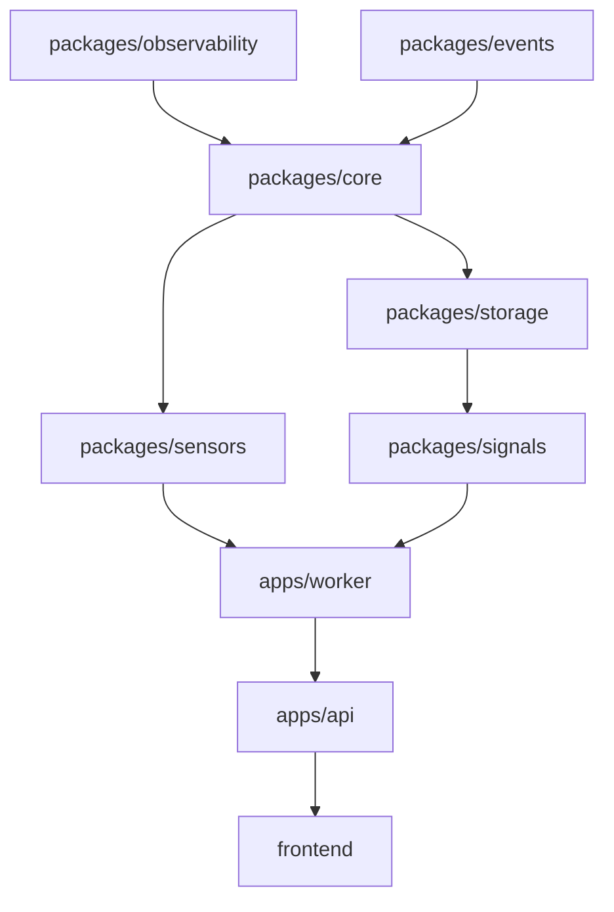

# Aegis-Alpha: Implementation Plan

## 1. Dependency Graph

## 2. Execution Phases (Detailed)

### Phase 1: Scaffolding (Week 1)
- **Repo Setup**: Initialize monorepo, linters, and CI/CD pipelines.
- **Observability**: Implement structured JSON logging and metric exporters.
- **Events**: Define core event schema and internal bus interfaces.

### Phase 2: Ingestion & TimescaleDB (Weeks 2-3)
- **Storage Layer**: Setup TimescaleDB migrations and SQLAlchemy models.
- **Sensor Base**: Implement `BaseSensor` and its async execution runner.
- **Persistence Worker**: Implement service that subscribes to raw data events and persists them to hypertables.

### Phase 3: Signal Engine (Weeks 4-5)
- **Factor Logic**: Implement modular factor calculation classes.
- **Signal Processor**: Build the service that consumes raw events and emits normalized signals.
- **Replay Utilities**: Build tools to stream historical data through signals.

## 3. PR Breakdown Strategy
1. **INFRA-001**: Repository initialization, workspace config, and CI/CD.
2. **CORE-001**: `packages/events` and `packages/observability` foundations.
3. **DB-001**: `packages/storage` with TimescaleDB hypertable migrations.
4. **SENSOR-001**: `packages/sensors` abstract classes and mock support.
5. **WORKER-001**: `apps/worker` boilerplate and event loop.
6. **API-001**: `apps/api` FastAPI skeleton and health monitoring.

## 4. Failure Modes & Resilience
- **Data Gap Recovery**: Automated detection of missing price data and trigger for historical backfill sensors.
- **Backpressure**: Use of internal buffers and flow control in the async pipeline to handle data bursts.
- **Signal Drift**: Real-time comparison of expected vs. actual signal outputs with automated alerting.

## 5. Scaling Risks
- **Event Volume**: High-frequency data may saturate PostgreSQL; strategy is to move to Kafka for the hot-path event bus while keeping TimescaleDB for historical storage.
- **Query Latency**: As historical logs grow, query performance on signals may degrade; mitigation involves strict retention policies and automated aggregate tables (Continuous Aggregates in TimescaleDB).

## 6. Testing & Observability Strategy
- **Unit Testing**: 100% coverage requirement for `packages/signals` and `packages/events`.
- **Deterministic Testing**: Sensors must pass integration tests in `MOCK_MODE` to ensure perfect reproducibility.
- **Observability**: Every factor score calculation must include a `trace_id` linking it to the raw data event that triggered it.

## 7. Data Model Evolution
- **Schema Migration**: Using Alembic for database versioning.
- **Event Versioning**: Events include a `version` field to support non-breaking changes to data schemas.
- **Immutability**: Once an event is written to the hypertable, it is never modified. Corrections are handled by emitting a "CorrectionEvent".
